# Basic Pentesting
```
Joe Vinyard | 20220317
```

# Task 1: Web App Testing and Privilege Escalation
In these set of tasks you'll learn the following:
* brute forcing
* hash cracking
* service enumeration
* Linux Enumeration

The main goal here is to learn as much as possible.  Make sure you are connected to our network using your [OpenVPN configuration file](https://tryhackme.com/access).

Credits to [Josiah Pierce](https://www.vulnhub.com/author/josiah-pierce,569/) from Vulnhub.

*Answer the questions below* 

1. Deploy the machine and connect to our network
    ```
    no answer needed
    ```
    Machine IP: 10.10.144.208

2. Find the services exposed by the machine
    ```
    no answer needed
    ```
    Despite not needing to provide an answer, the obvious choice for inital enumeration is to run nmap against the target with `nmap -sC -sV 10.10.144.208 -vv -oA nmap/initial`.


    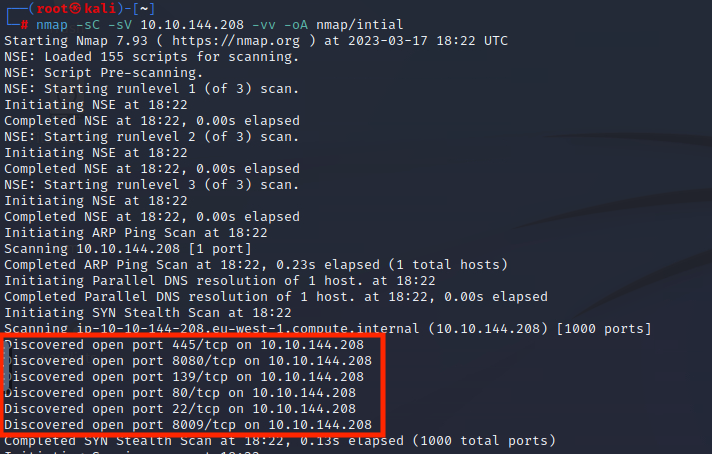

    We can see that there are at least 6 open ports running a variety of services (SMB, SSH, a webserver, etc.)

    Let's open up a browser and navigate to 10.10.144.208 
    
    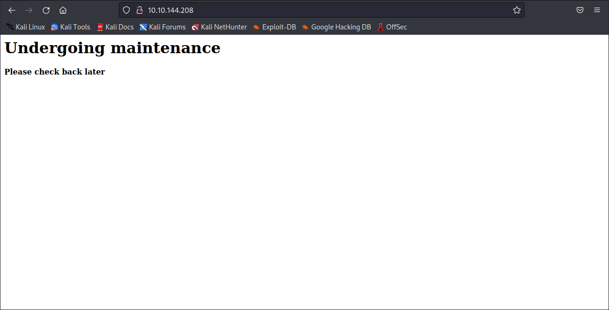

    It appears to be under maintenance, but let's check the source just to be sure... 
    
    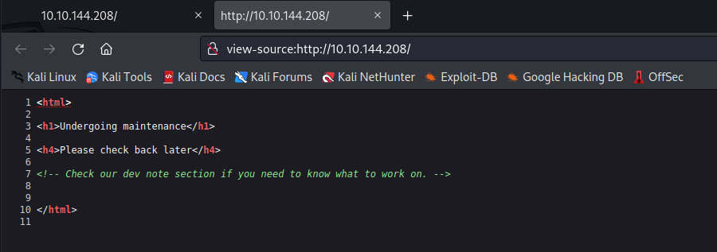

    There's a comment in the source code that says `"Check our dev note section if you need to know what to work on."`  It might be worth our while to do some directory enumeration with gobuster...
    
    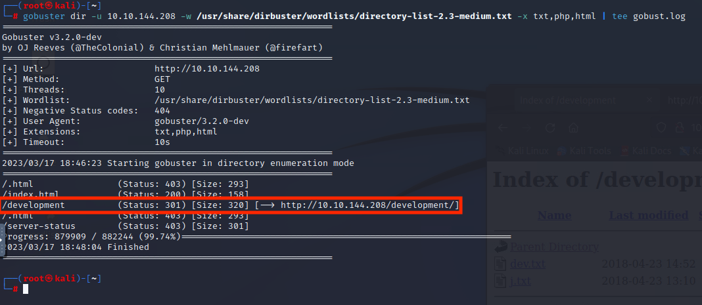

3. What is the name of the hidden directory on the web server(enter name without /)?
    ```
    development
    ```
    Thanks to gobuster, we were able to find `10.10.144.208/development` which lead us to the development directory where we can see a `dev.txt` and a `j.txt` file.  Let's grab those and see what info they have. 
    
    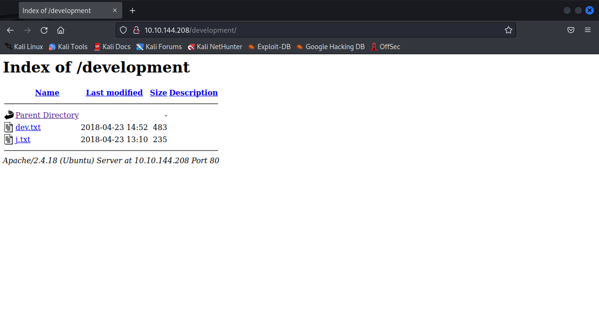

    Running `wget 10.10.144.208/development/{dev.txt,j.txt}` on both files downloads them locally where we can inspect their contents.  We can also just click the file names on the `/development` directory, but I opted for the former. 
    
    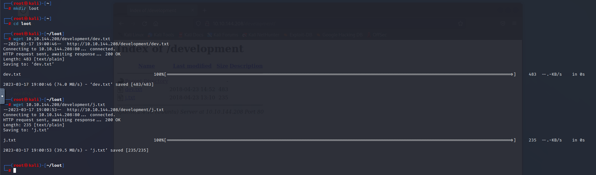

    If we then inspect the contents of the files we grabbed we can see that we've got two users, "K" and "J". 
    
    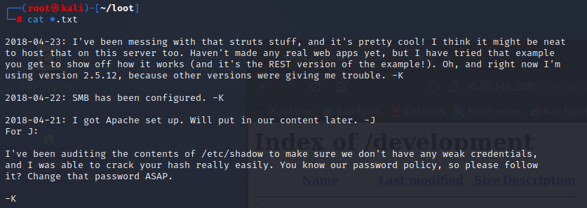

    There are a couple of things we can glean from the information we've gathered thus far. 
    
    * "K" has been working on struts (we can reasonably believe what's meant is [Apache Struts](https://struts.apache.org/)) 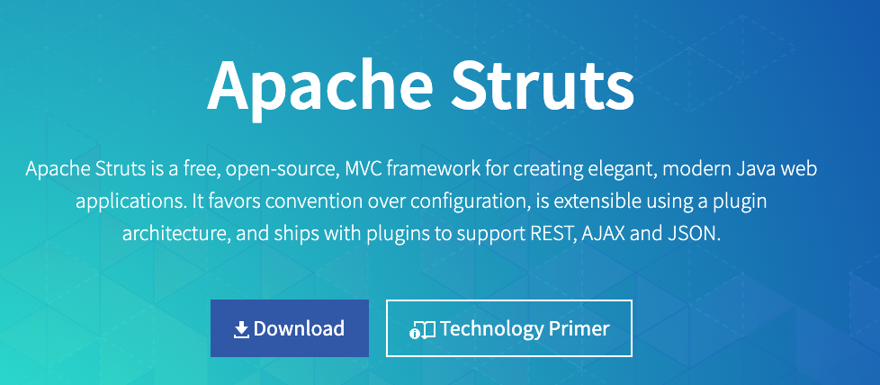
    * "K" has left "J" a note that J's password hash was easily cracked.  This tells us that J's plaintext password probably doesn't meet length/complexity requirements 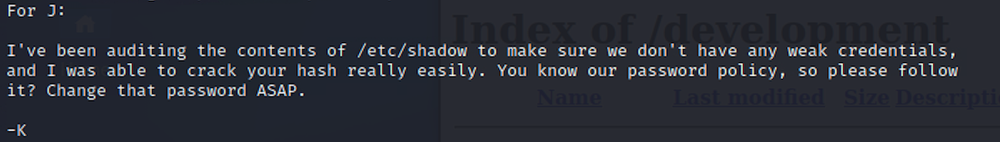

    We also know from our initial nmap scan that smb is running on this machine.  Let's see what we're able to enumerate with smbclient. 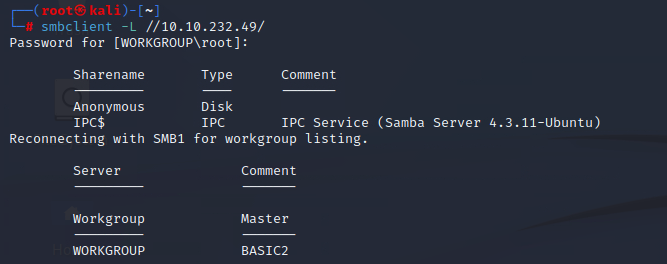

    Looks like we can sign in without specifying a password, let's see if we can connect to the `Anonymous` share 
    
    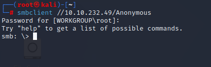  
    If we run `dir` inside smbclient it'll list out the directory contents and we find a file called `staff.txt`.  Let's grab a copy of it and see what it says. 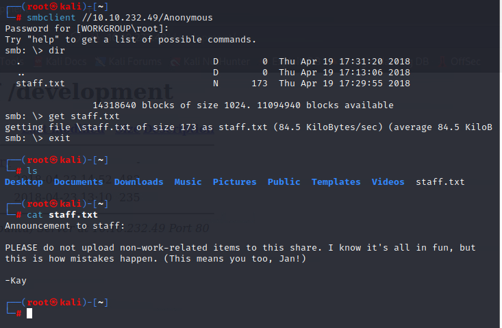

4. User brute-forcing to find the username & password
    ```
    no answer needed
    ```
5. What is the username?
    ```
    Jan
    ```
    I think it's safe to presume that `"J"` and `"K"` are `"Jan"` and `"Kay"`, but let's try some bruteforcing to be sure.

    Previously, we learned that Kay had sent a message to Jan regarding a weak password hash.  We also learned in our initial nmap scan that port 22 is open.  Let's see if we can leverage hydra with Jan's name and a wordlist to bruteforce our way onto the machine. 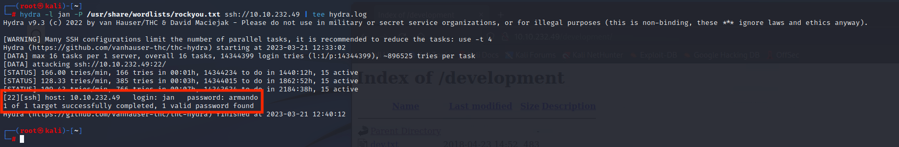

6. What is the password?
    ```
    armando
    ```
7. What service do you use to access the server (answer in abbreviation in all caps)?
    ```
    SSH
    ```
    Look's like Jan's password is `armando`, let's see if we can use that to login via SSH.

    Looks like we've got a shell 
    
    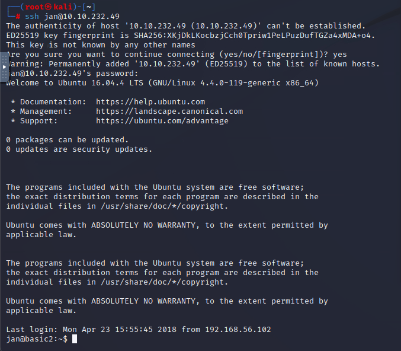

    Doesn't look like there's anything of interest inside Jan's directory and it doesn't look like we can run sudo either.
    
    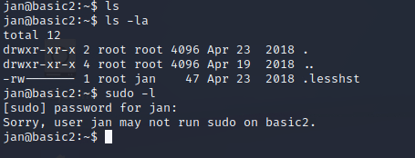
    
    We need to find a way to escalate our privileges...

8. Enumerate the machine to find any vectors for privilege escalation
    ```
    no answer needed
    ```

    This looks like the perfect opportunity to leverage linPEAS.

    Let's perform the following:
    
    * Grab a copy of [linPEAS](https://github.com/carlospolop/PEASS-ng/releases/download/20230319/linpeas.sh)
    * Serve it up via http server in python on our attacking machine
    * Download it to our victim in the `/dev/shm` directory
        
        * We want to leverage /dev/shm because it's globally writeable and runs as root
    * Run linPEAS and see what privilege escalation opportunities exist for us

    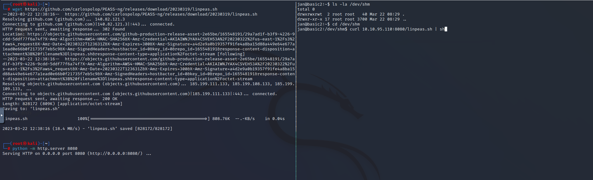

    Running linPEAS we get some of the following output 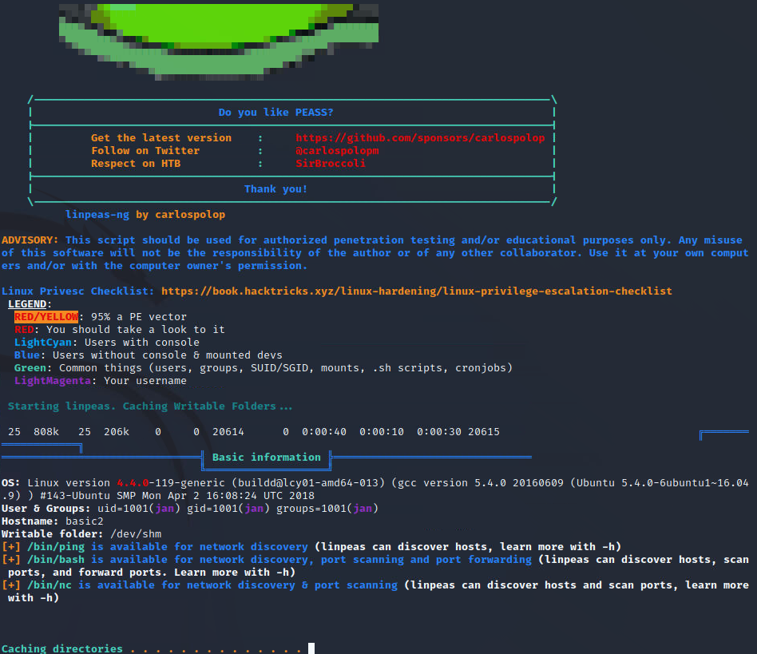

    One of the more interesting finds is that Kay (our other user) has their *private SSH key readable*, we should definitely look into this...
    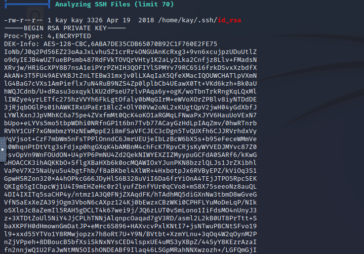

    Let's grab this private key really quick and try to login as Kay.

    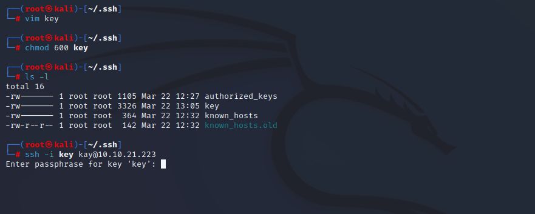

    Maybe not...the key file is password protected.  What can we do?  
    
    Luckily, we can leverage [ssh2john](https://github.com/openwall/john/blob/bleeding-jumbo/run/ssh2john.py), a python script used to convert a private key to a text format that plays nicely with [John The Ripper](https://www.openwall.com/john/)

    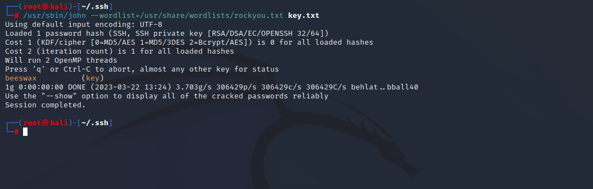

    We find that kay's key file password is `beeswax` and are able to now login with her private key 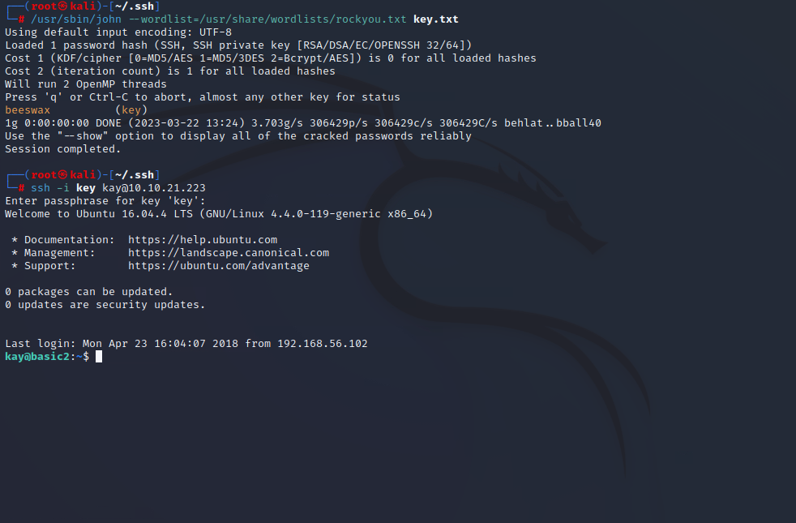

9. What is the name of the other user you found (all lower case)?
    ```
    kay
    ```
10. If you have found another user, what can you do with this information?
    ```
    no answer needed
    ```
11. What is the final password you obtain?
    ```
    heresareallystrongpasswordthatfollowsthepasswordpolicy$$

    ```

    Just for shits and gigs let's see what level of access Kay has. Running `sudo -l` and passing the very long password above 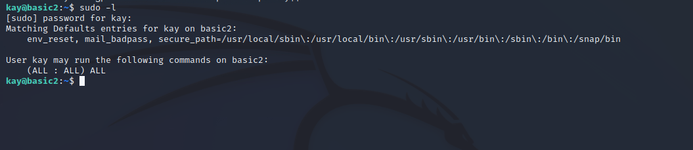

    We can see that Kay can run all commands as sudo.  Let's demonstrate why this can be dangerous.
    
    Opening vim with `sudo vim` and then running (in normal mode) `"! /bin/bash"`  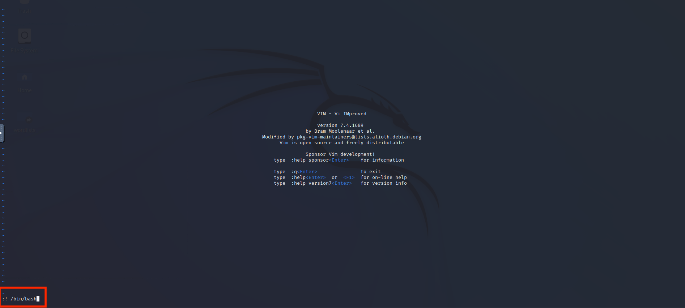

    we can see that we're able to open a bash shell *as root*. 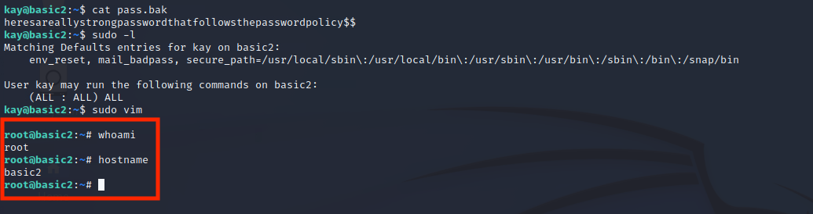

    Here's a look at it in real time
    
    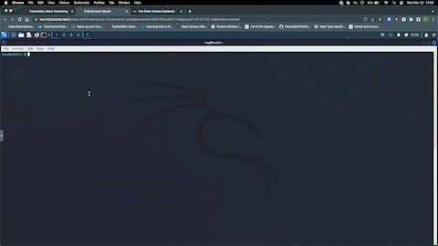

    So, how does this work?  Well, when using vim in normal mode (usually entered via the escape key), you can run commands to do all sorts of cool stuff in vim like perform some regex wizardy.  What we're doing in the above gif (sorry for the quality), is opening a shell in a buffer.  Since we initially opened vim with sudo, we're inheriting the shell we've opened as root.

    There's probably a more technical answer out there somewhere, but my IQ is barely room temp most days, so I hope that makes sense.

     So...are there any neat things in the /root directory? 

     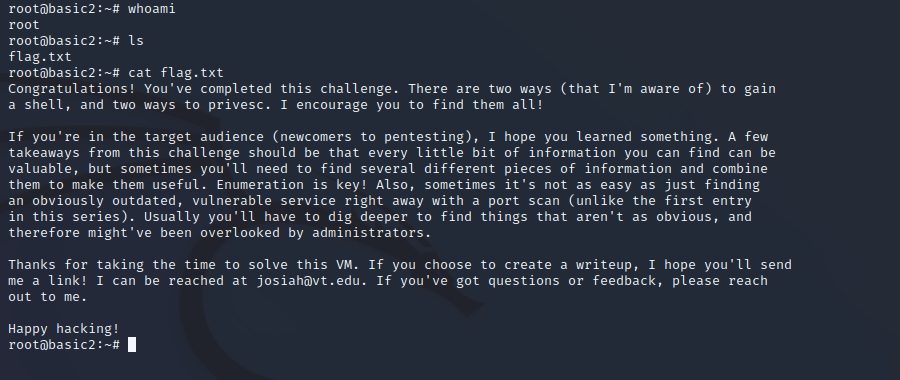


    Anywho, that's all for this one!
